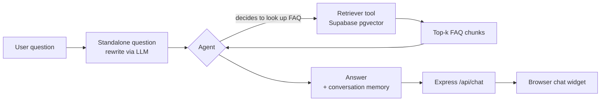
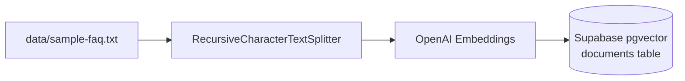

# RAG Support Assistant

A retrieval-augmented generation (RAG) FAQ support chatbot for a fictional VPS
hosting brand ("Nimbus Cloud"), built with [LangChain.js](https://js.langchain.com/),
OpenAI, and Supabase's pgvector-backed vector store.

It started as a set of small exercises for learning LangChain's Expression
Language (`RunnableSequence`) and grew into a working Express API + browser
chat widget. The `module/` folder keeps the intermediate steps around because
the progression itself — plain prompt chain → standalone-question rewriting →
context-stuffed RAG → agentic RAG — is a useful reference for anyone learning
the same path.

## What this demonstrates

- **Document ingestion & embedding** — chunking a text knowledge base and
  embedding it into a vector store.
- **Conversational query rewriting** — turning a follow-up question into a
  standalone question before retrieval, so retrieval quality doesn't degrade
  in multi-turn conversations.
- **Two RAG retrieval strategies**, side by side:
  - **Context-stuffing** (`index.js`): retrieve documents yourself, concatenate
    them, and inject the text directly into the prompt.
  - **Agentic / tool-calling RAG** (`server.js`, the running app): wrap the
    retriever as a callable tool and let an OpenAI-functions agent decide
    *whether and when* to call it, based on the conversation.
- **Conversation memory** across turns via `OpenAIAgentTokenBufferMemory`.
- A minimal Express API + vanilla JS chat widget serving as the client.

## Architecture



Ingestion (run once, or whenever the FAQ source changes):



## Project structure

| Path | Purpose |
| --- | --- |
| `server.js` | The running app: Express API + agentic RAG chain (`/api/chat`). |
| `index.js` | Standalone script demonstrating the context-stuffing RAG variant end-to-end. |
| `module/vector-initialization.js` | One-off ingestion script: splits `data/sample-faq.txt` and writes embeddings to Supabase. |
| `module/standalone-question.js` | Isolated example of the question-rewriting step. |
| `module/retriever-chaining.js` | Early exercise chaining a retriever into a prompt (kept for reference; superseded by `index.js`/`server.js`). |
| `module/runnable-sequence.js` | Unrelated `RunnableSequence` exercise (punctuation → grammar → translation), kept as a LangChain Expression Language reference. |
| `module/prompt-template.js` | Minimal single-prompt example. |
| `utils/retriever.js` | Builds the Supabase `SupabaseVectorStore` retriever. |
| `utils/document.js` | Combines retrieved document chunks into a single context string. |
| `public/` | Static chat widget (HTML/CSS/JS) served by Express. |
| `data/sample-faq.txt` | Fictional, generic Nimbus Cloud FAQ used as the demo knowledge base. |

## Prerequisites

- Node.js 18+
- An [OpenAI API key](https://platform.openai.com/api-keys)
- A [Supabase](https://supabase.com/) project with the `vector` extension enabled

## Setup

1. **Install dependencies**

   ```bash
   npm install
   ```

2. **Configure environment variables** — copy `.env.example` to `.env` and fill
   in the values:

   ```bash
   cp .env.example .env
   ```

3. **Create the Supabase table and search function.** Run this in the
   Supabase SQL editor (adjust `vector(1536)` if you use a different
   embeddings model):

   ```sql
   create extension if not exists vector;

   create table documents (
     id bigserial primary key,
     content text,
     metadata jsonb,
     embedding vector(1536)
   );

   create function match_documents (
     query_embedding vector(1536),
     filter jsonb default '{}'
   ) returns table (
     id bigint,
     content text,
     metadata jsonb,
     similarity float
   )
   language plpgsql
   as $$
   #variable_conflict use_column
   begin
     return query
     select
       id,
       content,
       metadata,
       1 - (documents.embedding <=> query_embedding) as similarity
     from documents
     where metadata @> filter
     order by documents.embedding <=> query_embedding;
   end;
   $$;
   ```

4. **Ingest the sample FAQ into the vector store:**

   ```bash
   npm run ingest
   ```

   To use your own knowledge base instead, set `FAQ_FILE_PATH` in `.env` to
   point at your own text file before running `npm run ingest`.

5. **Run the server:**

   ```bash
   npm start
   ```

   Then open `http://localhost:3000` for the chat widget, or call the API
   directly:

   ```bash
   curl -X POST http://localhost:3000/api/chat \
     -H "Content-Type: application/json" \
     -d '{"question": "Which server locations are available?"}'
   ```

## Roadmap / further RAG research

Ideas for extending this as a learning project:

- Swap `combineDocuments` string-stuffing for source citations returned to the client.
- Add a reranking step (e.g. cross-encoder) after initial vector retrieval.
- Try hybrid search (keyword + vector) for exact-match queries like plan names or error codes.
- Stream tokens back to the client instead of waiting for the full agent response.
- Add an eval set (question → expected answer/citation) to measure retrieval quality across changes.
- Swap the vector store for a self-hosted option (e.g. pgvector without Supabase, or Chroma) to compare setup cost.

## License

MIT — see [LICENSE](./LICENSE).
